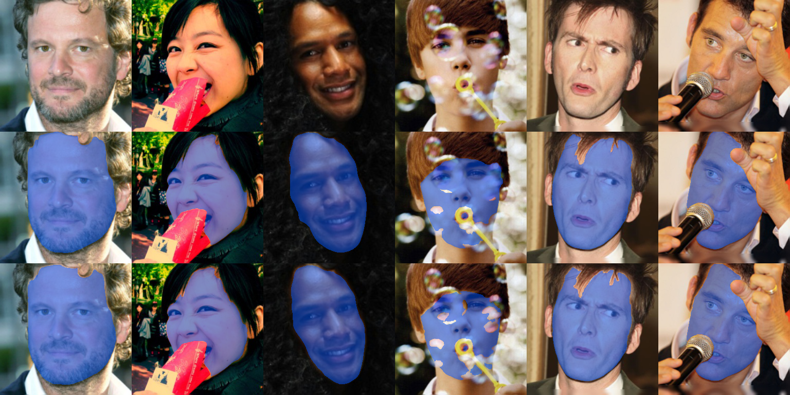

# FaceExtraction

[FaceOcc: A Diverse, High-quality Face Occlusion Dataset for Human Face Extraction](https://arxiv.org/pdf/2201.08425.pdf)

> Occlusions often occur in face images in the wild, troubling face-related tasks such as landmark detection, 3D reconstruction, and face recognition. It is beneficial to extract face regions from unconstrained face images accurately. However, current face segmentation datasets suffer from small data volumes, few occlusion types, low resolution, and imprecise annotation, limiting the performance of data-driven-based algorithms. This paper proposes a novel face occlusion dataset with manually labeled face occlusions from the CelebA-HQ and the internet. The occlusion types cover sunglasses, spectacles, hands, masks, scarfs, microphones, etc. To the best of our knowledge, it is by far the largest and most comprehensive face occlusion dataset. Combining it with the attribute mask in CelebAMask-HQ, we trained a straightforward face segmentation model but obtained SOTA performance, convincingly demonstrating the effectiveness of the proposed dataset. 

# Requirements
* PyTorch > 1.6.0
* [Segmentation Models](https://github.com/qubvel/segmentation_models.pytorch)
* PIL
* cv2
* numpy 

# How to use 
1. Download CelebAMask-HQ dataset, detect the facial landmarks using [3DDFAv2](https://github.com/cleardusk/3DDFA_V2)
2. Specify the directories in `face_align/process_CelebAMaskHQ.py`
3. Run `face_align/process_CelebAMaskHQ.py` to generate&align CelebAMask-HQ images and masks
4.Download FaceOcc and put it under Dataset directory
5.Run train.py

# Dataset 
[FaceOcc](https://drive.google.com/drive/folders/1K_V0AwhLT_TfHUny9sMA5PZ9KmEQSy05?usp=sharing)

# Pretrained Model
[Pretrained Model](https://drive.google.com/file/d/11cOc1KJnkR6hNp1l0vnMmCDxGTOCtsEb/view?usp=sharing)

# Results
Face masks are shown in blue. From top to bottom are input images, predicted masks, and the ground truth: 



# Citation
```
@misc{yin2022faceocc,
      title={FaceOcc: A Diverse, High-quality Face Occlusion Dataset for Human Face Extraction}, 
      author={Xiangnan Yin and Liming Chen},
      year={2022},
      eprint={2201.08425},
      archivePrefix={arXiv},
      primaryClass={cs.CV}
}
```
# Our paper is accepted by (TAIMA2022)[http://www.arts-pi.org.tn/TAIMA2020/] 
